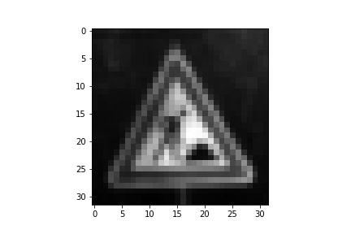
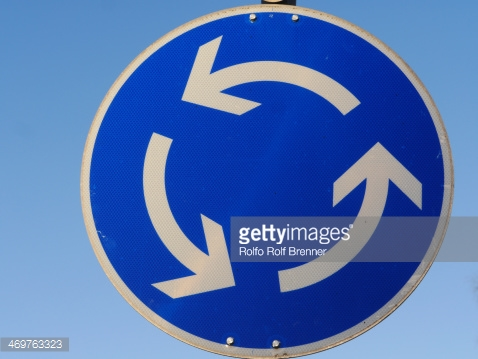

# **Traffic Sign Recognition** 

---

**Build a Traffic Sign Recognition Project**

The goals / steps of this project are the following:
* Load the data set (see below for links to the project data set)
* Explore, summarize and visualize the data set
* Design, train and test a model architecture
* Use the model to make predictions on new images
* Analyze the softmax probabilities of the new images
* Summarize the results with a written report

[//]: # (Image References)

[image1]: ./examples/visualization.jpg "Visualization"
[image2]: ./examples/grayscale.jpg "Grayscaling"
[image3]: ./examples/random_noise.jpg "Random Noise"
[image4]: ./examples/placeholder.png "Traffic Sign 1"
[image5]: ./examples/placeholder.png "Traffic Sign 2"
[image6]: ./examples/placeholder.png "Traffic Sign 3"
[image7]: ./examples/placeholder.png "Traffic Sign 4"
[image8]: ./examples/placeholder.png "Traffic Sign 5"

## Rubric Points
### Here I will consider the [rubric points](https://review.udacity.com/#!/rubrics/481/view) individually and describe how I addressed each point in my implementation.  

---
### Writeup / README

#### 1. Provide a Writeup / README that includes all the rubric points and how you addressed each one. You can submit your writeup as markdown or pdf. You can use this template as a guide for writing the report. The submission includes the project code.

You're reading it! and here is a link to my [project code](https://github.com/udacity/CarND-Traffic-Sign-Classifier-Project/blob/master/Traffic_Sign_Classifier.ipynb)

### Data Set Summary & Exploration

#### 1. Provide a basic summary of the data set and identify where in your code the summary was done. In the code, the analysis should be done using python, numpy and/or pandas methods rather than hardcoding results manually.

The code for this step is contained in the second code cell of the IPython notebook.  

I used the numpy library to calculate summary statistics of the traffic
signs data set:

* The size of training set is 34799
* The size of test set is n_test
* The shape of a traffic sign image is (32, 32, 3)
* The number of unique classes/labels in the data set is 43

#### 2. Exploratory visualization of the dataset and identify where the code is in your code file.

The code for this step is contained in the section *Exploratory visualization of the dataset* in Step 1 of the IPython notebook. Here are three samples:

### Design and Test a Model Architecture

#### 1. Describe how, and identify where in your code, you preprocessed the image data. What tecniques were chosen and why did you choose these techniques? Consider including images showing the output of each preprocessing technique. Pre-processing refers to techniques such as converting to grayscale, normalization, etc.

The code for this step is contained in the fourth code cell of the IPython notebook.

As a first step, I decided to convert the images to grayscale because it reduces the dimensionality of the dataset and allows for a classification that is not biased on color (although red and blue colors might help identify the traffic sign in question).

Then the picture was resized (if it was not the standard size to begin with) to (32, 32, 1), then normalized to a mean of 0 (values ranging from -0.5 to 0.5). Normalization was used to ensure that the classification is not skewed towards large or small number values.

Here is an example of a traffic sign image after each step.

Resized image

Greyed image

Normalized image

#### 2. Describe how, and identify where in your code, you set up training, validation and testing data. How much data was in each set? Explain what techniques were used to split the data into these sets. (OPTIONAL: As described in the "Stand Out Suggestions" part of the rubric, if you generated additional data for training, describe why you decided to generate additional data, how you generated the data, identify where in your code, and provide example images of the additional data)

Since training, testing, and validation datasets were already provided, I did not have to split the dataset. This was convenient. 

#### 3. Describe, and identify where in your code, what your final model architecture looks like including model type, layers, layer sizes, connectivity, etc.) Consider including a diagram and/or table describing the final model.

The code for my final model is located in the seventh cell of the ipython notebook. 

My final model consisted of the following layers:

| Layer         		|     Description	        					| 
|:---------------------:|:---------------------------------------------:| 
| Input         		| 32x32x1 grayscale image   					| 
| Convolution 3x3     	| 1x1 stride, valid padding, outputs 28x28x6 	|
| RELU					|												|
| Max pooling	      	| 2x2 stride,  outputs 14x14x6					|
| Convolution 3x3	    | 1x1 stide, valida padding, outputs 10x10x16 	|
| RELU					|												|
| Max pooling	      	| 2x2 stride,  outputs 5x5x16					|
| Fully connected		| input :400, output: 120						|
| RELU					|												|
| Fully connected		| input: 120, output: 84						|
| RELU					|												|
| Fully connected		| input: 84, output: 43							|
| Softmax				| 	        									|

#### 4. Describe how, and identify where in your code, you trained your model. The discussion can include the type of optimizer, the batch size, number of epochs and any hyperparameters such as learning rate.

The code for training the model is located in the section *Train, Validate and Test the Model* in Step 2.
The following hyperparametere and training algorithms were used:

|        Parameter/Algorithm  		|     Value	        					| 
|:---------------------:|:---------------------------------------------:| 
| Epoch number         		| 150					| 
| Learning rate     	| 0.001 	|
| Batch size					|			100									|
| Weight initialization	      	| Normal distribution, mean 0, sd, 0.1					|
| Convolution 3x3	    | 1x1 stide, valida padding, outputs 10x10x16 	|
| Error term			| mean squared error												|
| Optimization algorithm	      	| Adam optimizer				|

#### 5. Describe the approach taken for finding a solution. Include in the discussion the results on the training, validation and test sets and where in the code these were calculated. Your approach may have been an iterative process, in which case, outline the steps you took to get to the final solution and why you chose those steps. Perhaps your solution involved an already well known implementation or architecture. In this case, discuss why you think the architecture is suitable for the current problem.

The code for calculating the accuracy of the model is located in the section **Analyze Performance** in Step 3.

My final model results were:
* training set accuracy of 0.999999992121
* validation set accuracy of 0.951473929985
* test set accuracy of 0.936737955891

<!-- If an iterative approach was chosen:
* What was the first architecture that was tried and why was it chosen?
* What were some problems with the initial architecture?
* How was the architecture adjusted and why was it adjusted? Typical adjustments could include choosing a different model architecture, adding or taking away layers (pooling, dropout, convolution, etc), using an activation function or changing the activation function. One common justification for adjusting an architecture would be due to over fitting or under fitting. A high accuracy on the training set but low accuracy on the validation set indicates over fitting; a low accuracy on both sets indicates under fitting.
* Which parameters were tuned? How were they adjusted and why?
* What are some of the important design choices and why were they chosen? For example, why might a convolution layer work well with this problem? How might a dropout layer help with creating a successful model?
 -->

A well known architecture was chosen:
* The LeNet architicture was chosen since it's use to identify written symbols has a strong resembelance to the requirement of classifying street signs.
* This relevancy was considered since both written characters and street signs contain visual clues in their shape, something that was evidently targeted when the LeNet architecture was constructed.
* The model performs adequately well, with a **validaiton loss of `0.951473929985` and a test accuracy of `0.936737955891`**
 

### Test a Model on New Images

#### 1. Choose five German traffic signs found on the web and provide them in the report. For each image, discuss what quality or qualities might be difficult to classify.

Here are five German traffic signs that I found on the web:

 
 
 

These images were chosen for their diversity of backgrounds as well as the sign color, and the type of writing that is on them (graphical illustration vs. digits). Image number 4 (70 speed limit) might be difficult to classify since the sign is not centered in the image.

#### 2. Discuss the model's predictions on these new traffic signs and compare the results to predicting on the test set. Identify where in your code predictions were made. At a minimum, discuss what the predictions were, the accuracy on these new predictions, and compare the accuracy to the accuracy on the test set (OPTIONAL: Discuss the results in more detail as described in the "Stand Out Suggestions" part of the rubric).

The code for making predictions on my final model is located in the tenth cell of the Ipython notebook.

Here are the results of the prediction:

| Image			        |     Prediction	        					| 
|:---------------------:|:---------------------------------------------:| 
| Ground work   		| Bicycle crossing   									| 
| General Caution		| General Caution 										|
| Round abaout			| Priority Road									|
| 70 km/h	      		| No Entry					 				|
| 30 km/h	      		| 30 km/h					 				|
| 50 km/h	      		| 50 km/h					 				|

The model was able to correctly guess 3 of the 6 traffic signs, which gives an accuracy of 50%. This compares not so favorably to the accuracy on the test set. This could be because of the image quality and capture of the image data. For example, some photos had watermarks on them, and were resized to a wider stretch, and some signs were not in the center of the image.

#### 3. Describe how certain the model is when predicting on each of the five new images by looking at the softmax probabilities for each prediction and identify where in your code softmax probabilities were outputted. Provide the top 5 softmax probabilities for each image along with the sign type of each probability. (OPTIONAL: as described in the "Stand Out Suggestions" part of the rubric, visualizations can also be provided such as bar charts)

The code for making predictions on my final model is located in the **Predict the Sign Type for Each Image** section.

For the first image, the model is quite sure that the sign is a bicycle crossing, with the highest probability being 0.85, and the second guess (which is correct, yay!) is 0.11 probability. All other probabilitie are quite distant.

| Probability         	|     Prediction	        					| 
|:---------------------:|:---------------------------------------------:| 
| .85         			| Bicycles crossing  									| 
| .11     				| Road Work										|
| .027					| Road narrows on the right										|
| .0	      			| double curve					 				|
| .0				    | traffic signals     							|

For the second image the model performs wonderfully and has a probability of 1 that it's a general caution sign, which it is.

| Probability         	|     Prediction	        					| 
|:---------------------:|:---------------------------------------------:| 
| 1         			| Genral Caution | 
| 0     				| Go straight or left										|
| 0					| right of way at next intersection										|
| .0	      			| pedestraisns				 				|
| .0				    | traffic signals     							|

For the third image the model is confused and thinks its a priority road. This could be due to the watermark on the image.

| Probability         	|     Prediction	        					| 
|:---------------------:|:---------------------------------------------:| 
| 1         			| priority road | 
| 0     				| speed limit 100									|
| 0					| right of way at next intersection										|
| .0	      			| pedestraisns				 				|
| .0				    | traffic signals     							|

For the fourth image the model is confused (possibly by the off centering of the sign) and thinks it is absolutely a no entry sign instead of a 70 kmph sign.

| Probability         	|     Prediction	        					| 
|:---------------------:|:---------------------------------------------:| 
| 0.98         			| No Entry | 
| 0.015   				| Right of way										|
| 0					| go straight of left										|
| .0	      			| roundabout				 				|
| .0				    | priority road     							|

For the fifth image the model performs wonderfully and has a probability of 1 that it's a 50 km/h sign!

| Probability         	|     Prediction	        					| 
|:---------------------:|:---------------------------------------------:| 
| 1         			| 50 km/h | 
| 0 				| speed limit 100									|
| 0					| priority road										|
| .0	      			| speed limit 30			 				|
| .0				    | roundabout  							|

For the sixth image the model performs wonderfully and has a probability of 1 that it's a 50 km/h sign!

| Probability         	|     Prediction	        					| 
|:---------------------:|:---------------------------------------------:| 
| 1         			| 30 km/h | 
| 0 				| Roundabout								|
| 0					| Wild animal crossing									|
| .0	      			| speed limit 50			 				|
| .0				    | speed limit 80							|
